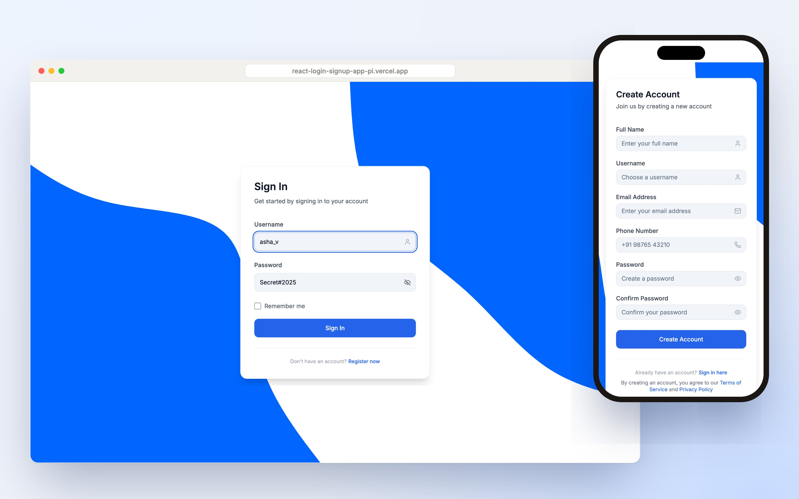
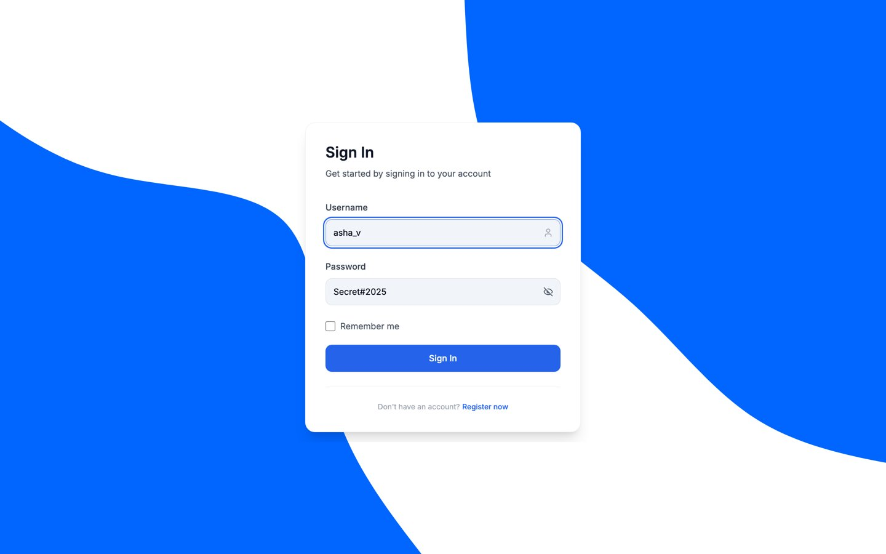
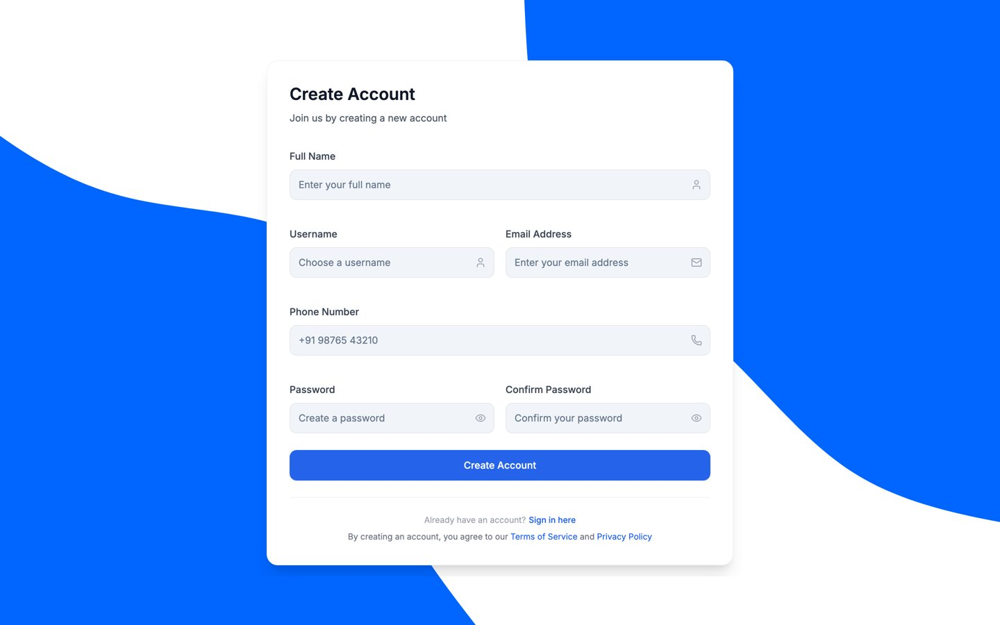
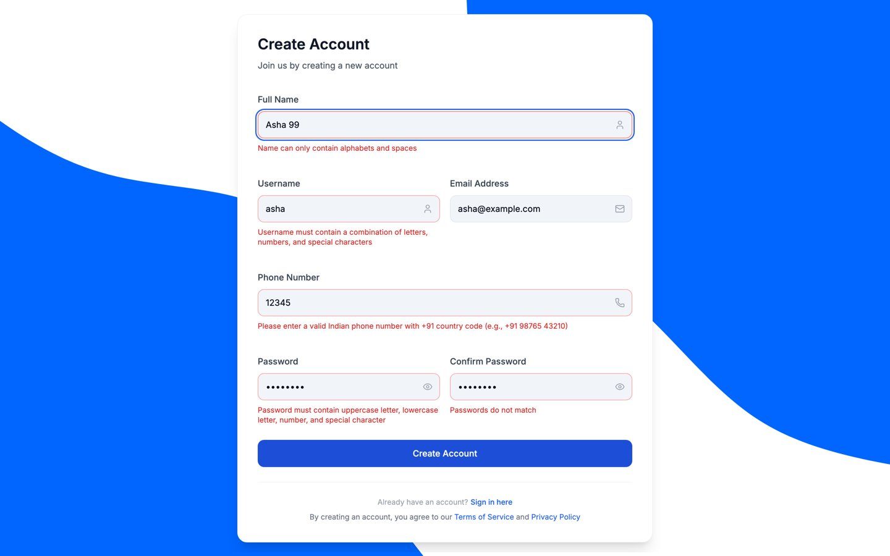
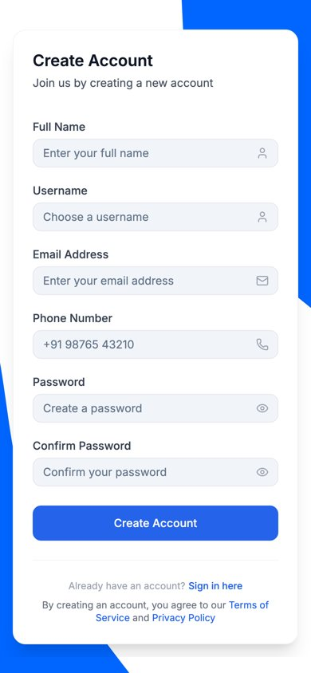

# React Login and Sign Up

Login and sign up pages built with React, React Hook Form, Tailwind CSS and shadcn/ui. The forms share one reusable component and validate every field as you type.

**[Live demo](https://react-login-signup-app-pi.vercel.app)**



## Features

- One reusable form component, configured with a list of fields
- Validation with clear messages under each field:
  - Full name: letters and spaces only
  - Username: a mix of letters, numbers and special characters
  - Email: valid email format
  - Phone: Indian number with the +91 country code
  - Password: uppercase, lowercase, number and special character, and different from the username
  - Confirm password: must match the password
- Show and hide password toggle
- Remember me option on login
- Routing between login (`/`) and sign up (`/register`)
- Responsive layout for mobile and desktop

## Screenshots

| Login | Sign up |
|---|---|
|  |  |

| Validation | Mobile |
|---|---|
|  |  |

## Tech stack

React 18 · Vite · React Hook Form · Tailwind CSS · shadcn/ui · Lucide icons · React Router

## Run locally

```bash
git clone https://github.com/yash-189/react-login-signup-app.git
cd react-login-signup-app
npm install
npm run dev
```

Then open http://localhost:5173.

## Notes

This project covers the frontend only. Login and sign up don't call a backend yet, so an auth API can be connected to the form submit handlers.
